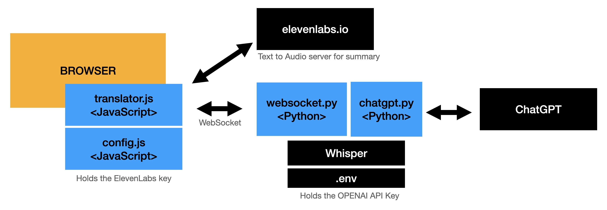

# Overview



# Installation

## Setup conda

Open a shell script and create a new python environment.


    conda create --name mic-app

    conda activate mic-app


Install the required Python modules

    cd src/main/server

    pip3 install -r requirements.txt


## Open AI KEY

Set your OpenAI key in .env

    echo "OPENAI_API_KEY='sk-xxxxxxxxxxxxxxxxxxxxxxxxxxxx'"  > .env

Get your OpenAI key from https://platform.openai.com/account/api-keys     

## ElevenLabs KEY (Optional)

For the summary audio you need to have an ElevenLabs key, but this is optional.

https://beta.elevenlabs.io/speech-synthesis  click on the profile menu itme.

Add this key in the config.js file.

### config.js

Create a config.js file in src/main/webapp/js which holds your ElevenLabs key.
This is used to convert the transcript summary and turn it into audio which is played on the Summary slide.

```javascript
const config = {
    audioKey: '0e5cbxxxxxxxxxxxxxxxxxxxxxxxxxxxxxx'    
};
```

# Export your slides to HTML 

## Keynote

You need to update the exported HTML slides to include the translation buttons and related javascript code.

In the generated index.html file add the following:

The css for the buttons and translation text layout

```HTML
    <link rel="stylesheet" href="../../webapp/css/styles.css">  
```

The actual buttons in the header.  Place this right underneath the body tag.

```HTML
<body id="body" bgcolor="black">
    <div class="container">
        <div id="translatedText"></div>
        <div class="filler">
          <label for="source-lang">From</label>
          <select id="source-lang">
            <option value="en">English</option>
            <option value="nl">Dutch</option>
            <option value="fr">French</option>
            <option value="es">Spanish</option>
          </select>
          <label for="target-lang">To</label>
          <select id="target-lang">
            <option value="fr">French</option>
            <option value="nl">Dutch</option>
            <option value="es">Spanish</option>
            <option value="en">English</option>
          </select>
          <button id="start">Start</button>
          <button id="stop"  disabled>Stop</button>
        </div>
    </div>    
```

And at the end of the HTML <body> tag add the needed javascript import.

```HTML
        <script src="assets/player/main.js"></script>           <!-- already there                       -->

        <script src="../../webapp/js/config.js"></script>       <!-- the config with the elevenLabs key  -->
        <script src="../../webapp/js/translator.js"></script>   <!-- the translator script               -->
```

## PowerPoint

I don't use PowerPoint, so maybe someone else can do this? 


# Start WebSocket

1. Start the websocket python app which will accept audio chuncks from the browser.

```
    python3 websocket.py
```    

3. Open the updated index.html which contains the slides.  
3. Select the from/to languages and press "Start". 

Every 20 seconds the audio is pushed to the python app, it converts the webm to text using Whisper and asks ChatGPT to translate it.


    

